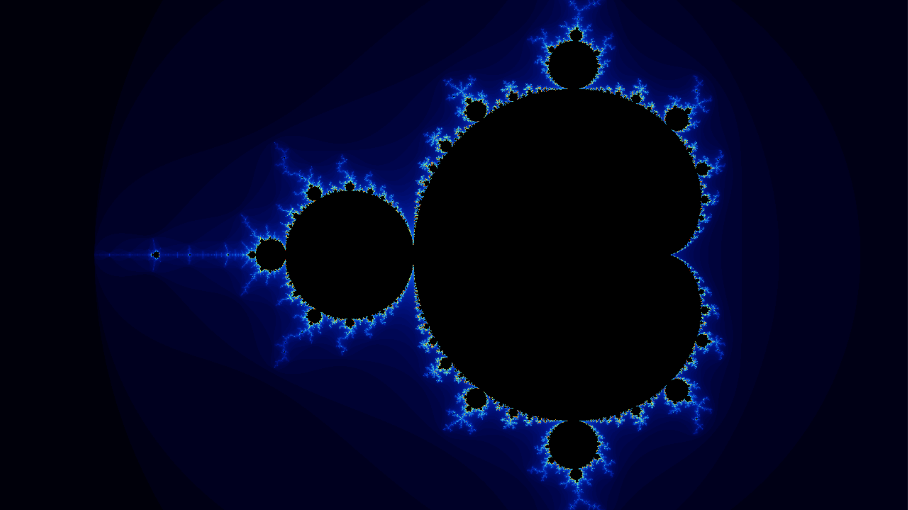
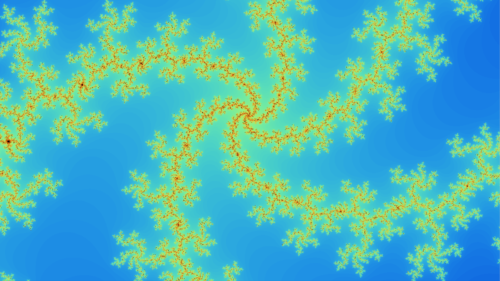

# Mandelbrot Renderer (CUDA + OpenGL + SDL3)
This small project was my introduction to writing CUDA kernels and integrating them with OpenGL for visualization.
It’s not a full-fledged fractal explorer — it’s a compact, self-contained experiment to learn how GPU compute, graphics interop, and real-time rendering fit together.

## Purpose
- Learn the basics of CUDA kernel launches, memory management, and device synchronization.
- Understand CUDA–OpenGL interop, and how to visualize GPU-computed data efficiently.
- Practice CMake for mixed C++/CUDA projects.
- Build something visual and interactive while learning the CUDA workflow.

## Overview
The program computes the Mandelbrot set entirely on the GPU using CUDA, writes the result into a buffer, and then displays it in real time through OpenGL.
SDL3 handles window creation, input, and context management.

Each frame:
1. The CUDA kernel computes iteration counts per pixel.
2. The results are written into an RGBA buffer.
3. OpenGL displays the buffer as a fullscreen triangle.
4. Mouse and keyboard input let you zoom in and out towards the mouse position.

## Controls
| Action | Key/Mouse |
| --- | --- |
| Zoom in/out | Mouse wheel |
| Reset view | `R` |
| Increase/decrease iterations | `+`/`-` |
| Quit | `Esc` |

## Building
Precompiled binaries are available in releases, but if you'd like to build it yourself follow the following instructions:
### Windows
```bash
cmake -B build -DCMAKE_TOOLCHAIN_FILE="path/to/vcpkg.cmake"
cmake --build build --config Release
```
### Linux
```bash
sudo apt install libsdl3-dev libglew-dev nvidia-cuda-toolkit
cmake -B build
cmake --build build
```
The executable will be placed in `bin/mandelbrot`.

## What I Learned
- Launching and debugging CUDA kernels.
- Managing device memory and understanding host ↔ device transfers.
- Using CUDA to generate visual data for OpenGL in real time.

## Future Ideas
- Implement direct CUDA–OpenGL PBO interop (skip the host copy).
- Add dynamic palettes and smooth coloring.
- Explore Julia sets.
- Introduce supersampling or FXAA for cleaner edges.
- Optimize kernel performance and early bailout logic.

## Screenshots



